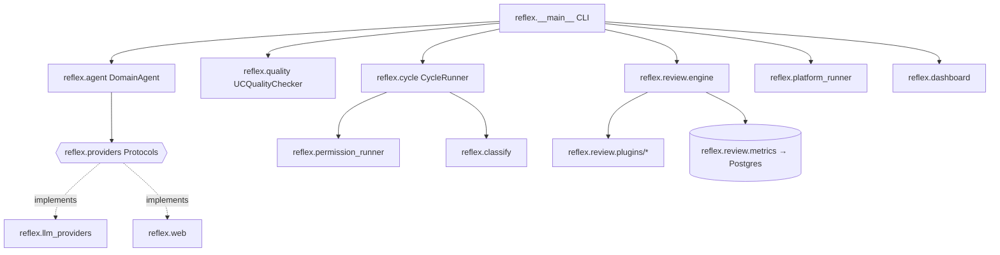
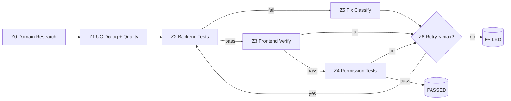
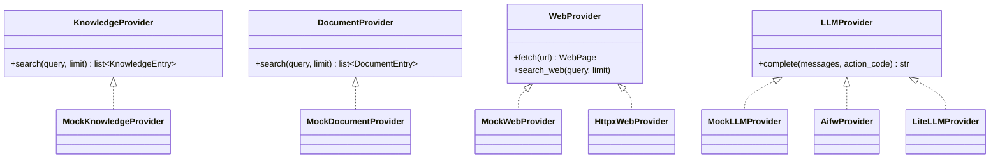

# REFLEX — Architecture & Developer Guide

> Companion to the user-facing [`README.md`](../README.md). This document explains
> **how REFLEX is built** — for contributors and integrators, not end users.
>
> Version 0.5.0 · Pure Python ≥ 3.12 · No Django dependency in core.

---

## Table of Contents

1. [Design Principles](#1-design-principles)
2. [Module Map](#2-module-map)
3. [The REFLEX Methodology (Z0–Z6)](#3-the-reflex-methodology-z0z6)
4. [Provider Architecture (Dependency Inversion)](#4-provider-architecture-dependency-inversion)
5. [Review Engine (Plugin System)](#5-review-engine-plugin-system)
6. [Cycle Orchestrator](#6-cycle-orchestrator)
7. [Web & SDS Layer](#7-web--sds-layer)
8. [Dashboard & Platform Runner](#8-dashboard--platform-runner)
9. [Optional-Dependency Matrix](#9-optional-dependency-matrix)
10. [CLI Surface](#10-cli-surface)
11. [Testing Strategy](#11-testing-strategy)
12. [ADR Landscape](#12-adr-landscape)

---

## 1. Design Principles

REFLEX is a **standalone PyPI package** that packages the iil.gmbh "evidence-based UI
development" methodology. Four principles shape the codebase:

| Principle | What it means in code |
|-----------|-----------------------|
| **Pure-Python core** | The default install (`pip install iil-reflex`) has only `iil-promptfw` + `pyyaml` as deps. UC checking, failure classification and the offline rule-based agent run with **no LLM, no network, no Django**. |
| **Dependency inversion** | The core depends on `Protocol`s (`reflex.providers`), never on concrete sources (Outline, Paperless, httpx, litellm). Concrete adapters are injected — or supplied as optional extras. See §4. |
| **Optional extras, not hard deps** | Heavy capabilities (LLM, web scraping, Playwright, Postgres metrics) live behind `[extras]` and are imported lazily inside functions, so a missing extra degrades to `SKIPPED`, never an `ImportError` at import time. |
| **Evidence over assertion** | The whole product is about producing *verifiable* signals (route status codes, permission-matrix results, quality-criteria pass/fail) rather than opinions. The review engine mirrors this with explicit `Finding`s carrying `severity` + `adr_ref`. |



---

## 2. Module Map

| Module | Responsibility | Key types |
|--------|----------------|-----------|
| `reflex.agent` | Domain research — offline rules + optional LLM enrichment | `DomainAgent` |
| `reflex.quality` | UC Quality Check — 11 criteria, offline | `UCQualityChecker` |
| `reflex.classify` | Failure triage: `UC_PROBLEM` vs `UI_PROBLEM` | `FailureClassifier` |
| `reflex.uc_dialog` | Interactive UC authoring with feedback loop | `UCDialogEngine` |
| `reflex.permission_runner` | Automated permission-matrix HTTP tests | `PermissionRunner` |
| `reflex.cycle` | Full dev-cycle orchestrator (Z0–Z6) | `CycleRunner`, `CycleConfig` |
| `reflex.scaffold` | Generate `reflex.yaml` (Tier 1 + Tier 2) | scaffold functions |
| `reflex.platform_runner` | Cross-hub health reports | `PlatformRunner` |
| `reflex.dashboard/` | Local dev landing page (stdlib `http.server`) | `DashboardHandler`, `run_dashboard` |
| `reflex.config` | Load `reflex.yaml` | `ReflexConfig` |
| `reflex.providers` | **Protocols** + mock implementations | `KnowledgeProvider`, `DocumentProvider`, `WebProvider`, `LLMProvider` |
| `reflex.llm_providers` | Concrete LLM adapters | `AifwProvider`, `LiteLLMProvider`, `get_provider` |
| `reflex.web` | HTTP resilience + SDS lookups | `HttpxWebProvider`, `PubChemAdapter`, `GESTISAdapter`, `PDFDocumentProvider` |
| `reflex.review/` | Plugin-based repo review engine (ADR-165) | `ReviewEngine`, `ReviewPlugin`, `Finding`, `ReviewResult` |
| `reflex.types` | Shared dataclasses | `WebPage`, `SDSData`, `KnowledgeEntry`, … |
| `reflex.__main__` | CLI entry point | `main()` + `cmd_*` |

---

## 3. The REFLEX Methodology (Z0–Z6)

`CycleRunner.run_full_cycle()` orchestrates the loop. Each phase yields a structured
`PhaseResult`; failures feed the classifier and trigger a bounded retry
(`max_fix_iterations`, default 3).



| Phase | Enum | Runner | Mechanism |
|-------|------|--------|-----------|
| Z2 | `BACKEND_TEST` | `_run_backend_tests` | `subprocess.run(backend_test_cmd)` + pytest-output parsing |
| Z3 | `FRONTEND_VERIFY` | `_run_frontend_verify` | `httpx` route checks (CSRF login session) |
| Z4 | `PERMISSION_TEST` | `_run_permission_tests` | delegates to `PermissionRunner.run_all()` |
| Z5 | `FIX_CLASSIFY` | `_classify_failure` | `FailureClassifier` on the first 5 errors |

> **Config source:** the `dev_cycle:` section of `reflex.yaml`
> (`base_url`, `login_url`, `backend_test_cmd`, `routes`, `max_fix_iterations`, …),
> loaded via `CycleConfig.from_yaml`.

---

## 4. Provider Architecture (Dependency Inversion)

`reflex.providers` defines four `runtime_checkable` `Protocol`s. The core (`DomainAgent`,
cycle, web lookups) depends only on these — concrete sources are injected.



- **Mocks ship in-package** (`reflex.providers`) — deterministic, used throughout the
  test suite. This is why tests need neither network nor an LLM key.
- **`LLMProvider` has two real adapters**, chosen by `get_provider(backend=...)`:
  - `AifwProvider` — Django/`iil-aifw` context: DB-driven model routing + usage logging.
  - `LiteLLMProvider` — standalone CLI: talks to litellm, reads API keys from env or
    `~/shared/secrets`.
  - `backend="auto"` tries aifw (needs Django), falls back to litellm.
- **Concrete knowledge/document providers** (Outline, Paperless, MCP) deliberately live
  *outside* this package — in hub code or the orchestrator MCP.

---

## 5. Review Engine (Plugin System)

`reflex.review` (ADR-165) is an auto-discovering plugin engine for repo governance checks.

**Plugin contract** — any object exposing:

```python
class ReviewPlugin(Protocol):
    name: str                  # e.g. "compose"
    applicable_tiers: list[int]
    def check(self, repo: str, context: dict) -> list[Finding]: ...
```

**Discovery** is `pkgutil`-based over `reflex/review/plugins/` — a plugin is found by
exposing a module-level `plugin` attribute. A crashing plugin is isolated
(`logger.error(..., exc_info=True)`) and contributes zero findings rather than failing
the whole run.

**Built-in plugins:** `repo`, `compose`, `adr`, `port`, `security`, `infra`,
`controlling`, `uc`.

**Governance state** lives under `.reflex/` in the target repo:
- `suppressions.yaml` — rule-level suppressions with optional `until:` expiry.
- `baseline.json` — known findings to subtract (ratchet, don't regress).

**Findings** carry `severity` (`block`/`warn`/`info`), optional `adr_ref` + `fix_hint`,
`auto_fixable` and a `fix_complexity` for model-tier routing. `ReviewResult.score_pct`
weights block=3, warn=1, info=0.

**Metrics** (`reflex.review.metrics.MetricsWriter`, extra `[metrics]`) persist one row per
plugin per run to a Postgres `reflex_metrics` table — degrades to a no-op (returns 0)
when `psycopg` or `DATABASE_URL` is absent.

---

## 6. Cycle Orchestrator

`CycleRunner` is intentionally **subprocess- and HTTP-driven** — it shells out to the
hub's own test command and probes real routes, rather than importing hub code. This keeps
REFLEX framework-agnostic.

Resilience points worth knowing:
- Backend tests have a 300 s timeout and surface `TimeoutExpired` / `FileNotFoundError`
  as `FAILED` `PhaseResult`s (not exceptions).
- Frontend verify is **skipped gracefully** if `httpx` is not installed.
- A fully failed cycle ends with `final_status = FAILED` (any non-`PASSED` loop exit).

---

## 7. Web & SDS Layer

`reflex.web` (extra `[web]`) is the only network-touching module. Design highlights:

- **`HttpxWebProvider`** — lazily constructs an `httpx.Client` behind a `threading.Lock`,
  is a context manager (`with ... as`), and wraps GETs in a tenacity retry
  (`_retry_get`: 3 attempts, exponential jitter) plus a `pyrate_limiter` rate limit.
- **`PubChemAdapter`** — name/CAS → `SDSData` via PubChem PUG REST + GHS classification
  parsing.
- **`GESTISAdapter`** — German hazardous-substance DB lookups.
- **`PDFDocumentProvider`** — text extraction (`iil-ingest[pdf,ocr]`, extra `[web-pdf]`).

All adapters take an optional `HttpxWebProvider` for injection/testing; tests use `respx`
to stub HTTP without real calls.

---

## 8. Dashboard & Platform Runner

- **`reflex.dashboard/`** (ADR-163/164) — a zero-dependency local landing page built on
  stdlib `http.server`, showing platform hubs as health tiles with docker start/stop.
  `registry.py` holds the canonical `HUBS` + compose-file discovery.
- **`reflex.platform_runner`** — aggregates cross-hub health into a `PlatformReport`,
  split into **Tier 1 (Full Reflex)** and **Tier 2 (Reflex Light)** hubs, printed as a
  terminal report by `cmd_platform`.

---

## 9. Optional-Dependency Matrix

| Extra | Pulls in | Unlocks |
|-------|----------|---------|
| *(core)* | `iil-promptfw`, `pyyaml` | `check`, `classify`, offline `research` |
| `llm` | `litellm` | LLM-backed research, `LiteLLMProvider` |
| `aifw` | `iil-aifw` | Django DB-routed LLM (`AifwProvider`) |
| `web` | `httpx`, `tenacity`, `hishel`, `pyrate-limiter`, `bs4` | scraping, PubChem/GESTIS SDS (installs from PyPI) |
| `web-pdf` | `[web]` + `iil-ingest[pdf,ocr]` (Git) | PDF/OCR text extraction |
| `playwright` | `playwright` | browser-driven frontend tests |
| `metrics` | `psycopg[binary]` | review-metrics persistence |
| `dev` | pytest, ruff, respx, … | the test/lint toolchain |
| `all` | everything above | — |

**Rule of thumb:** every optional import is wrapped so the feature degrades to `SKIPPED`
with a log line, never a hard crash. Preserve this when adding capabilities.

---

## 10. CLI Surface

All subcommands are `reflex <cmd>` (= `python -m reflex <cmd>`), dispatched from
`reflex.__main__:main`:

`check` · `research` · `scrape` · `sds` · `classify` · `uc-create` ·
`test-permissions` · `cycle` · `verify` · `init` · `platform` · `dashboard` · `info`

---

## 11. Testing Strategy

- **`make test`** runs the unit suite (no system deps). 339+ tests, ~5 s.
- Network is stubbed with `respx`; LLMs with `MockLLMProvider`; subprocess/httpx with
  `unittest.mock`. **No test should require a live service.**
- `@pytest.mark.integration` gates tests needing tesseract/poppler — run via
  `make test-integration`.
- Naming convention: `test_should_<expected_behavior>`.
- Lint: `ruff` with `E,F,I,W,UP,B,SIM`, line length 120, target `py312`.

---

## 12. ADR Landscape

REFLEX implements several platform ADRs — consult them before changing the relevant area:

| ADR | Area |
|-----|------|
| ADR-162 | REFLEX overall (see package `Documentation` URL) |
| ADR-163 | Scaffold, platform runner, dashboard (Tier 1/2) |
| ADR-164 | Canonical hub port list (dashboard registry) |
| ADR-165 | Review engine: plugin protocol, suppression, baseline, metrics |

---

*Generated as part of a codebase analysis. Keep this file in sync when module
responsibilities change — it is the map contributors read first.*
